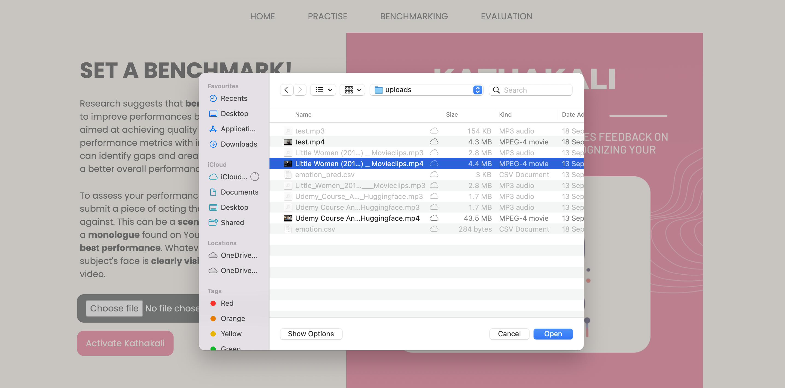

# Kathakali - Emotion Detection for Acting Practice

Welcome to **Kathakali**, a computer vision tool designed to accelerate your acting skills by analyzing your emotional performance using a CNN-based Emotion Detection Model. Whether you're perfecting a monologue or preparing for an audition, Kathakali helps you track your progress, compare it with benchmarks, and improve!


## Key Features


<p align="center"><i>Home</i></p>

### 1. **Set a Benchmark**
Benchmark your performance by submitting a video, whether it's from a favorite movie, a YouTube monologue, or even your best take. Ensure that the subject's face is clearly visible for accurate emotion tracking.


<p align="center"><i>Set a Benchmark</i></p>

#### Step 1. Upload a Video

<p align="center"><i>Upload .mp4 video</i></p>


<p align="center"><i>Upload .mp4 video</i></p>

#### Step 2. Activate Kathakali

<p align="center"><i>Activate Kathakali</i></p>

### 2. **Live Practice**
Test your emotions live! Kathakali uses CNN technology to detect and label emotions as you act. Practice with this tool to improve emotional delivery and alignment with the benchmark.

### 3. **Evaluate My Performance**
Upload your benchmarked audio file, perform your scene, and let Kathakali compare your emotions to the set benchmark. It provides insights on how closely your performance aligns with the ideal.

## Installation

To get started with **Kathakali**, clone this repository:

```bash
git clone https://github.com/your-username/kathakali.git
cd kathakali
```

## Installation

To install the required packages:

```bash
pip install -r requirements.txt
```

To run the application:

```bash
python main.py
```

## How to Use

### Step 1: Set a Benchmark
- Upload a video of your selected performance.
- Ensure the subject's face is visible for accurate emotion detection.
- Download the audio file for the performance.

### Step 2: Live Practice
- Test your emotional expressions in real-time.
- The model will display your detected emotions as you act.

### Step 3: Evaluate Your Performance
- Upload the benchmark audio file and perform the scene.
- Kathakali will compare your live performance with the benchmark and provide feedback.

## Contributing
Feel free to submit issues or pull requests. For major changes, please open an issue to discuss what you’d like to change.

## License
This project is licensed under the MIT License.

---

For more details on the project, feel free to explore the website or the full documentation.

```vbnet
Make sure to replace `"your-image-url-here"` with the actual URLs for your images/screenshots, and `"your-website-url-here"` with the link to your website or documentation.
```

